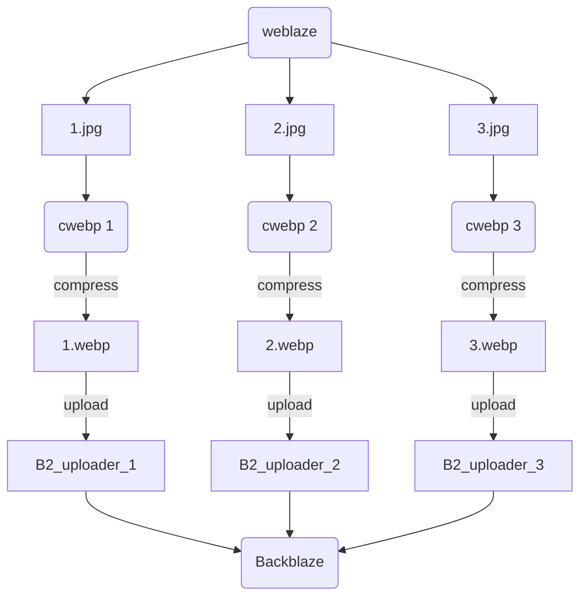

# weblaze

<p align="center">

</p>

<p align="center">
<a href="https://pypi.org/project/weblaze/"></a>
<a href="https://pypistats.org/packages/weblaze"></a>
<a href="https://opensource.org/licenses/MIT"></a>
</p>


**Usage**:

```console
$ weblaze [OPTIONS] COMMAND [ARGS]...
```

**Options**:

- `--install-completion`: Install completion for the current shell.
- `--show-completion`: Show completion for the current shell, to copy it or customize the installation.
- `--help`: Show this message and exit.

**Commands**:

- `edit`: Edit the configuration file in the...

- `init`: Initialize and generate a configuration...

- `run`: main function

## Configuration

  ```yaml
  backblaze:
      application_key_id: ***
      application_key: ***
      bucket_name: ***
  local:
      compressor: ***\cwebp.exe
  ```

## Commands


### `edit`

Edit the configuration file in the system's default editor.

**Usage**:

```console
$ edit [OPTIONS]
```

**Options**:

- `--help`: Show this message and exit.

### `init`

Initialize and generate a configuration file in the user's .config directory.

**Usage**:

```console
$ init [OPTIONS]
```

**Options**:

- `--help`: Show this message and exit.

### `run`

main function

**Usage**:

```console
$ run [OPTIONS]
```

**Options**:

- `-i, --local-directory TEXT`: Path to the local directory where images are stored [default: ./]
- `--compress-max INTEGER`: max workers to compress [default: 3]
- `--upload-max INTEGER`: max workers to upload [default: 3]
- `--help`: Show this message and exit.


